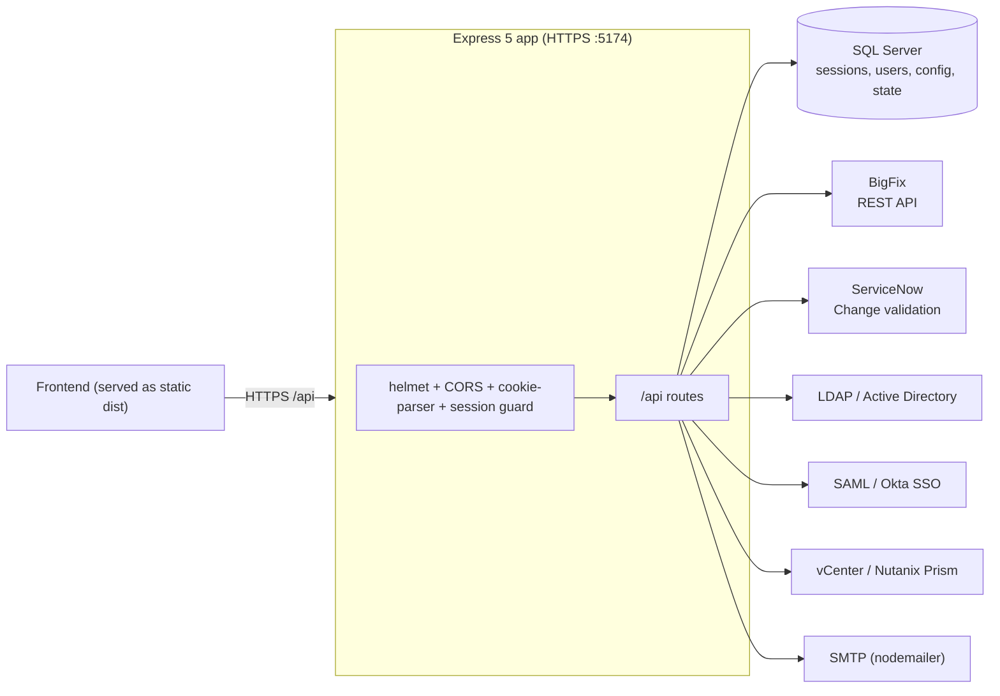

# BigFix Patch Orchestrator — Backend

The API and orchestration engine behind the BigFix Patch Orchestrator. A **Node.js + Express 5**
service that drives a **Sandbox → Pilot → Production** patch workflow on top of ** BigFix**,
enforces promotion gates, computes health/success KPIs, and integrates with ServiceNow, LDAP/AD,
SAML SSO, vCenter/Nutanix Prism, and SMTP. It also **serves the built frontend** as static assets,
so the whole app runs from one HTTPS origin.

> This repository is the **backend only**. The React/Vite UI lives in a separate frontend repo; its
> production build is served by this service.

---

## Table of contents

- [Tech stack](#tech-stack)
- [Architecture](#architecture)
- [Prerequisites](#prerequisites)
- [Running the server](#running-the-server)
- [Configuration](#configuration)
- [Security model](#security-model)
- [Project structure](#project-structure)
- [API surface](#api-surface)
- [Integrations](#integrations)
- [Logs & certificates](#logs--certificates)
- [Troubleshooting](#troubleshooting)

---

## Tech stack

| Area | Choice |
| --- | --- |
| Runtime | Node.js (packaged to a Windows executable via [`pkg`](https://github.com/vercel/pkg)) |
| Web framework | Express `5` |
| Transport | HTTPS only (`https`), TLS 1.2+, PFS-only cipher suite |
| Security | `helmet` (CSP/HSTS/frameguard), `cors` allowlist, `cookie-parser` |
| Database | Microsoft SQL Server via `mssql` |
| BigFix | REST API over `axios` + `xml2js` |
| Directory / SSO | `ldapts` (LDAP/Active Directory), `@node-saml/node-saml` (SAML/Okta) |
| Virtualization | vCenter + Nutanix Prism (`axios`/`got`) |
| Email | `nodemailer` |
| Logging | `winston` + `winston-daily-rotate-file` |
| Certs | `selfsigned` (auto-generate) or bring-your-own |

---

## Architecture



**Boot sequence** (`main.js`):

1. `runDatabaseSetup()` — ensure the SQL Server schema exists.
2. `loadDbConfig()` — load and decrypt configuration overrides from the DB.
3. `buildApp()` — construct the Express app, middleware, and routes.
4. `getSSLOptions()` — use `certs/server.key` + `certs/server.cert` if present, otherwise
   auto-generate a self-signed cert into `certs/auto-server.*` (valid for localhost, local IPs,
   and any configured host).
5. `https.createServer(...).listen(5174, "0.0.0.0")`.

---

## Prerequisites

- **Node.js ≥ 18** (Express 5 requires a modern Node) — only needed to run from source or to build
  the executable. A prebuilt `PatchSetuBackend.exe` can run without Node installed.
- **Microsoft SQL Server** reachable from the host (the app creates/uses its schema on boot).
- ** BigFix** root server reachable, with a **Master Operator** account for administrative
  actions (role/operator management).
- **Windows** is the primary target (configuration can be read from the Windows Registry, and the
  app ships as a Windows `.exe`). It can run on other platforms when configuration is supplied via
  the database or environment variables (registry reads are simply skipped off-Windows).

---

## Running the server

### Option A — prebuilt executable (Windows)

```text
PatchSetuBackend.exe
```

Starts the HTTPS server on port **5174** (default). Boot logs go to the console and to `logs/`.

### Option B — from source

```bash
npm install
node main.js
```

> `package.json` currently defines only a placeholder `test` script; the entry point is `main.js`.
> You may want to add `"start": "node main.js"`.

### Option C — build the executable

The repo is configured for `pkg` (see the `pkg` block in `package.json`, which bundles `src/**/*.js`):

```bash
npx pkg . --targets node18-win-x64 --output PatchSetuBackend.exe
```

Ship the resulting `.exe` alongside the `certs/`, `logs/`, and the frontend build directory.

---

## Configuration

Configuration is resolved by `src/env.js` by **layering**, later sources overriding earlier ones:

1. **Windows Registry** — `HKLM\SOFTWARE\WOW6432Node\BigFixPatchSetu` (Windows only).
2. **Encrypted database overrides** — the `AppConfiguration` table, edited in-app under
   **Environment Settings**. Secret values are stored **encrypted at rest**.
3. **Process environment / `dotenv`** — for local development.

Secrets are encrypted with a key derived from **`ENCRYPTION_KEY`** — set this before storing any
credentials, and keep it stable (rotating it invalidates previously encrypted values).

### Key settings

| Key | Purpose |
| --- | --- |
| `PORT` | HTTPS listen port (default `5174`) |
| `FRONTEND_DIR` | Directory of the built frontend to serve (default `frontend_dist`) |
| `FRONTEND_URL` | Comma-separated CORS allowlist of allowed origins |
| `ENCRYPTION_KEY` | Master key for encrypting/decrypting stored secrets |
| `SESSION_TIMEOUT` | Session lifetime (minutes) |
| `DB_*` | SQL Server host/instance/database/credentials |
| `BIGFIX_BASE_URL` / `BIGFIX_USER` / `BIGFIX_PASS` | BigFix root server + Master Operator |
| `BIGFIX_ALLOW_SELF_SIGNED` | Accept BigFix's self-signed TLS cert |
| `SANDBOX_* / PILOT_* / PRODUCTION_BIGFIX_*` | Per-stage BigFix overrides (fall back to the base) |
| `SN_*` | ServiceNow base URL / credentials for CHG validation |
| `LDAP_*` (incl. `LDAP_BIND_PASSWORD`) | Active Directory bind + search |
| `SMTP_*` | Mail server for notifications/reports |
| `VCENTER_*` | vCenter for snapshots/clones |
| `PRISM_*` | Nutanix Prism for snapshots/clones |

> **Do not commit real credentials.** Provide them at runtime via the registry, the in-app
> Environment Settings (encrypted DB), or environment variables. Use placeholders in any examples.

The following config keys are treated as secrets and encrypted: `BIGFIX_PASS` (and the stage
variants), `SN_PASSWORD`, `SMTP_PASSWORD`, `VCENTER_PASSWORD`, `PRISM_PASS`, `LDAP_BIND_PASSWORD`.

---

## Security model

- **HTTPS-only**, TLS 1.2 minimum, with a PFS-only cipher list (no SHA-1/CBC/static-RSA exchange).
- **`helmet`** with a strict Content-Security-Policy, HSTS, `frameAncestors 'none'` (clickjacking
  protection), and same-origin CORP/COOP.
- **CORS allowlist** built from `FRONTEND_URL`; requests from unlisted origins are rejected.
- **Sessions** are server-side and DB-backed: the client holds an opaque **HTTP-only cookie**, and
  session records live in SQL Server (expired sessions are purged). Route guards `requireAuth` /
  `requireAdmin` enforce access.
- **RBAC**: roles and site/computer scoping are resolved against BigFix (with a Master-Operator
  bypass); the active role is validated server-side, not trusted from the client.
- **Secrets at rest** are AES-encrypted using `ENCRYPTION_KEY`; responses are passed through a
  sanitizer so secrets are never returned to the client.

---

## Project structure

```
backend/
├── main.js                     # Entry point: DB setup -> config -> app -> HTTPS server
├── PatchSetuBackend.exe        # Prebuilt Windows executable (pkg)
├── Patch Orchestrator.bes      # BigFix task/fixlet for deployment
├── certs/                      # server.key/.cert (custom) or auto-server.* (generated)
├── logs/                       # winston daily-rotate log output
└── src/
    ├── app.js                  # Express app: middleware, CORS, route mounting, static SPA
    ├── env.js                  # Config loader (registry + encrypted DB + env) & context
    ├── envManage.js            # Config read/write helpers
    ├── db/
    │   ├── mssql.js            # SQL Server connection pool
    │   └── setup.js            # Schema bootstrap on startup
    ├── middlewares/
    │   ├── session.js          # DB-backed sessions, requireAuth/requireAdmin, purge
    │   ├── auth.middleware.js
    │   └── responseSanitizer.js# Strips secrets from responses
    ├── routes/                 # HTTP endpoints (mounted under /api)
    │   ├── auth.js  config.js  env.js  health.js  workflow.js  pilot.js
    │   ├── actions.js  actionsHelpers.js  deployments.js  baseline.js
    │   ├── groups.js  groupUpdate.js  roles.js  sites.js  query.js
    │   ├── snValidate.js  vcenter.js  calendar.js  policies.js
    │   └── patches.js  cves.js  riskBaselines.js  predict.js
    ├── controllers/            # Request handlers
    │   ├── auth.controller.js  saml.controller.js  setup.controller.js
    │   ├── team.controller.js
    │   ├── actions/            # triggerAction, etc.
    │   ├── pilot/              # pilot.controller, production.controller
    │   └── user/              # getUsers, addUser, updateUserRole, index
    ├── services/
    │   ├── bigfix.js           # BigFix REST helpers (query, group members, health)
    │   ├── bigfix/             # assignRole, unassignRole, createOperator,
    │   │                       # verifyCredentials, verifyMasterOperator
    │   ├── roleService.js      # RBAC / site & computer scoping
    │   ├── ldap.js             # LDAP/AD auth & lookup
    │   ├── vcenter.js  prism.js  prismCache.js   # VM snapshot/clone
    │   ├── cacheWarmup.js  userWarmup.js         # startup cache priming
    │   ├── postpatchWatcher.js # post-patch monitoring + reports
    │   ├── workflowState.js    # orchestration/team state
    │   └── logger.js           # winston logger
    ├── mail/                   # nodemailer templates/senders
    ├── state/                  # in-memory/workflow state helpers
    ├── scripts/                # maintenance/utility scripts
    └── utils/                  # http helpers, query parsing, crypto, etc.
```

Static hosting: after the API routes, `app.js` serves `FRONTEND_DIR` with
`express.static(...)` and a SPA catch-all (`app.get(/.*/, ... index.html)`), so the frontend and API
share the same origin and port.

---

## API surface

All application endpoints are mounted under **`/api`**. Broad areas:

- **Auth & session** — `/api/auth/*` (login, login-config, team-state, users, roles, password
  reset, SAML callback at `/api/auth/saml/callback`).
- **Orchestration** — `/api/workflow`, `/api/pilot`, `/api/actions`, `/api/deployments`.
- **BigFix data** — `/api/query` (relevance proxy), `/api/baselines`, `/api/groups`, `/api/roles`,
  `/api/sites`, `/api/patches`, `/api/cves`.
- **Health & KPIs** — `/api/health/*` (critical health, reboot-pending; group-scoped or full fleet).
- **Config** — `/api/config`, `/api/env` (admin-only).
- **Change validation** — `/api/snValidate` (ServiceNow CHG state checks).
- **Infrastructure** — `/api/vcenter/*` (snapshots/clones), group updates.
- **Risk & scheduling** — `/api/riskBaselines`, `/api/policies`, `/api/calendar`, `/api/predict`.

> Note: request logging (`morgan`) intentionally skips `/health/` and `/infra/` URLs to keep the
> KPI polling out of the access log.

---

## Integrations

- ** BigFix** — role/operator management, computer groups, baselines, actions, and live health
  via session relevance and custom `Patch_Setu_*` properties. Per-stage BigFix targets are supported
  (Sandbox/Pilot/Production) with fallback to the base server.
- **SQL Server** — sessions, users, encrypted configuration, workflow/team state, calendar.
- **LDAP / Active Directory** — directory-backed login and user lookup.
- **SAML / Okta** — SSO login with an assertion callback endpoint.
- **ServiceNow** — validates that a Change Request is in the required state before promotion.
- **vCenter / Nutanix Prism** — take VM snapshots and clones as pre-patch safety steps.
- **SMTP** — pre/post-patch notifications and reports.

---

## Logs & certificates

- **Logs:** `logs/` (rotated daily by `winston-daily-rotate-file`). Boot, request, and `[RBAC]` /
  integration warnings land here.
- **Certificates:** drop `server.key` + `server.cert` into `certs/` to use your own TLS cert;
  otherwise the server generates and reuses `certs/auto-server.{key,cert}` (self-signed, so browsers
  show a one-time warning). To trust it org-wide, install a proper cert instead.

---

## Troubleshooting

- **Server exits on boot** — usually SQL Server is unreachable or `runDatabaseSetup()` failed; check
  `DB_*` settings and the startup log in `logs/`.
- **`/api/roles`, `/api/groups`, `/api/baselines` return 5xx or are slow** — typically the upstream
  BigFix server is overloaded (HTTP 503) or slow; the health/member lookups are cached to reduce
  load, but sustained BigFix latency will still surface.
- **CORS errors** — the requesting origin isn't in `FRONTEND_URL`; add it (comma-separated).
- **Role assignment "did not fully apply"** — BigFix rejected the role XML; the exact status/body is
  logged as a `[RBAC] PUT /api/role/... -> HTTP ...` warning.
- **Secrets show as blank after changing `ENCRYPTION_KEY`** — expected; values encrypted with the old
  key can't be decrypted. Re-enter credentials in Environment Settings.

---

*This service is the backend for the BigFix Patch Orchestrator. The React/Vite frontend lives in a
separate repository and is served from `FRONTEND_DIR` in production.*
